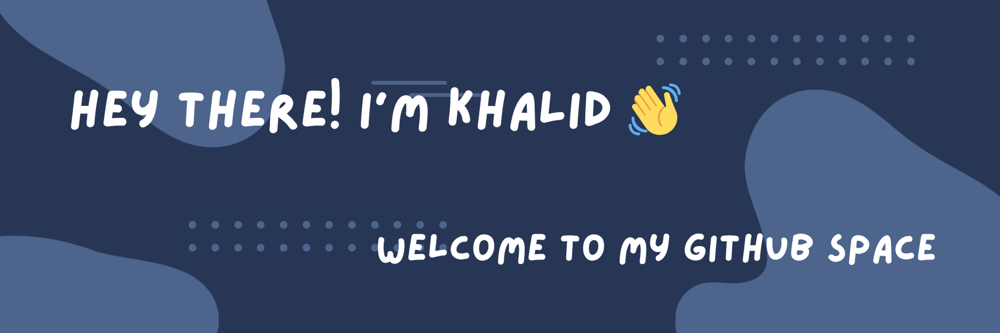

## ABOUT ME 
## 👋 Hi, I'm Khalid Alli-Balogun

🙋 I'm an 18 year old developer who loves turning cool ideas into real projects with JavaScript, Python, HTML and CSS . I love building interactive and function Web Applications and diving deep into how modern websites and tools are made.

🚀 I learn best by building projects and tackling real-world problems, it helps me understand concepts more deeply and see when and how apply them in practical situations.

## 🖥️ Qualifications
- FreeCodeCamp: JavaScript Algorithm and Data Structure (January 2025)   
- Meta: Introduction to Front-End Development (December 2024) 
- Meta: Programming with JavaScript (December 2024) 
- Harvard: Introduction to Computer Science (January 2023) 
- FreeCodeCamp: Responsive Web Design (August 2021) 

## Stats

## My major goals
My biggest goal as a software developer is to build a Mainstream Web Application that makes a real difference in people's lives. A tool thats not just functional but solves everday problems and improves how we experience the digital world.

## LinkedIn - www.linkedin.com/in/khalid-alli-balogun-150772399

## You can contact me through:
- 📧 khalidallib008@gmail.com
- 📞 +1 (204) 293 4749
